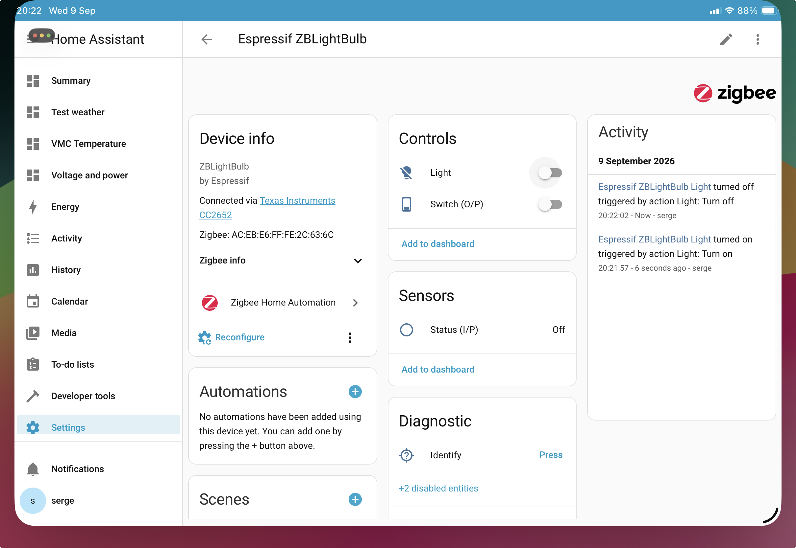

# sketch\_20260909\_Zigbee\_On\_Off\_Light

A basic version of a Zigbee endpoint.

Based on the following example sketches:

* Zigbee_On_Off_Light.ino
* Zigbee_Binary_Input_Output.ino

## Description

It contains a light, a binary input and a binary output.

On the ESP32-C6 side, we have the following I/O

* the built-in multicolour led, used as a black/white
* a button connected between GPIO xx and ground
* the boot button is used to force a factory reset, when pressed for 3 seconds

## Expected behaviour

* The led will react to 'turn on' and 'turn off' commands sent over the Zigbee network
* The led will follow the local push button, used as a switch:

  * when the user presses the button, the led turns on (if it was off)
  * when the user releases the button, the led turns off
  * the status changes is advertised over the network, the status of the light should change in HomeAssistant
* The binary input (Sensor) will follow the binary output (Switch)

## In HomeAssistant

* after pairing with HomeAssistant, I have the following elements for the device:
* in the 'Controls' section

  * a light
  * a switch, labeled 'Switch O/P'
* in the 'Sensors' section:

  * a sensor, labeled 'Status I/P'

## Behaviour
Moving the button on the right of the light from 'off' to 'on' or the other way around in HomeAssistant, the LED responds as expected. The icon of the light takes a bit more time to react. Looks like when the user moves the button, HomeAssistant sends the command over the Zigbee network but updates the icon only when the change is confirmed.

### View after pairing

